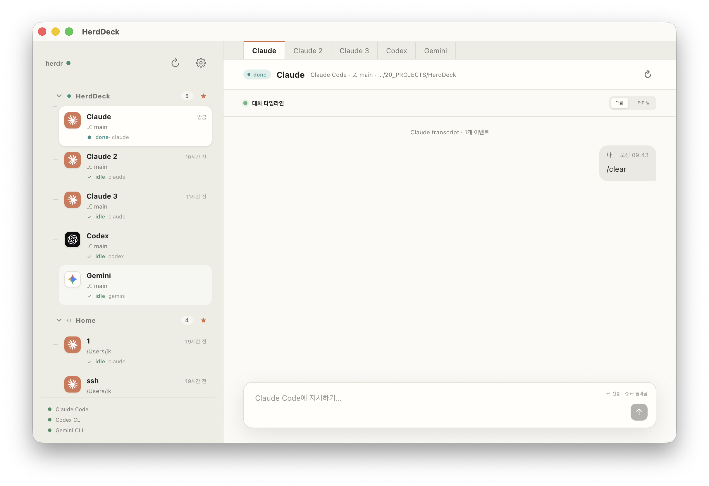

# herdDeck

herdDeck은 [herdr](https://herdr.dev)에 연결하는 데스크톱 클라이언트입니다.

herdr가 감지한 Claude Code, Codex CLI, Gemini CLI 세션을 한곳에서 확인하고 입력을 보낼 수 있습니다. 대화 타임라인은 각 CLI가 로컬에 저장한 트랜스크립트를 읽어 보여줍니다.

세션 실행과 제어는 herdr가 담당하며, herdDeck은 이를 데스크톱 UI로 표시합니다.



## 요구 사항

- macOS 또는 Unix 계열 환경
- Node.js 및 Rust
- 실행 중인 herdr와 Unix socket (`~/.config/herdr/herdr.sock`)
- 선택 사항: `claude`, `codex`, `gemini` CLI

## 개발 실행

```sh
npm install
npm run app
```

## 검증과 빌드

```sh
npm run build
cargo test --manifest-path src-tauri/Cargo.toml
npm run tauri build -- --debug --bundles app
```
